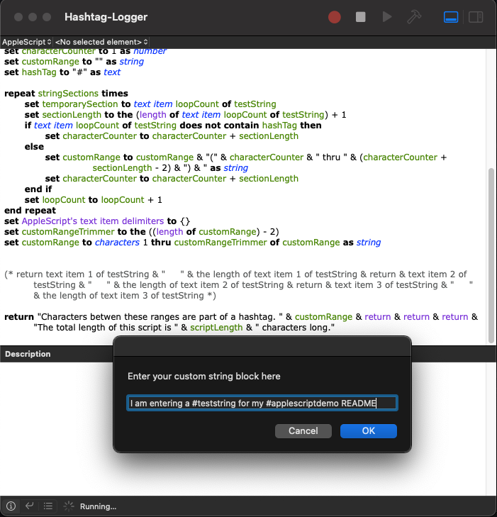
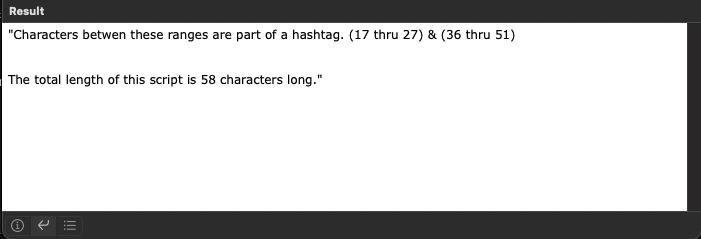

# <Applescripts>

## My Applescripts

The first project in this repository is a short script used to look at a string and return a report of which characters are part of a hashtag (starting the index at character 1). This script was developed to be used as part of a larger script that allowed the graphic design department of a print company where I used to work to copy and paste a caption into an artwork template, and then change the text formatting of each character that was part of a hashtag so that it would appear as a clikable hyperlink on a print file. This was my first time attempting to analize data within a string, and fortunately this project has not failed to deliver the desired result to me despite being fed all sorts of input strings from random customers.

The 2nd Project is a simple script to open the terminal and perform keystrokes to update the coursework supplied by Georgia Tech in their bootcamp program 

Other projects done in Applescript will be included as they are developed. 

## Installation

### Hashtag App

Any computer running MacOs that supports Applescript should execute the script without issue.

### Git Pull App

This also runs out of script editor, but will require that you open your Mac's preferences and give full access to Script Editor so that it may enter keystrokes into the terminal.

## Usage

### Hashtag App

Simply run the script in the application "Script Editor", paste an input string into the text field of the dialog box that pops up and get the reults in the "results" field of the script editor window. 

### Git Pull App

if you have your course materials on your desktop, you just run the script. If you are not part of the GA Tech Bootcamp, you may have to edit line # 10 betwee the double quotes to the name of your class directory
## Credits

List your collaborators, if any, with links to their GitHub profiles.

If you used any third-party assets that require attribution, list the creators with links to their primary web presence in this section.

If you followed tutorials, include links to those here as well.

## License

MIT